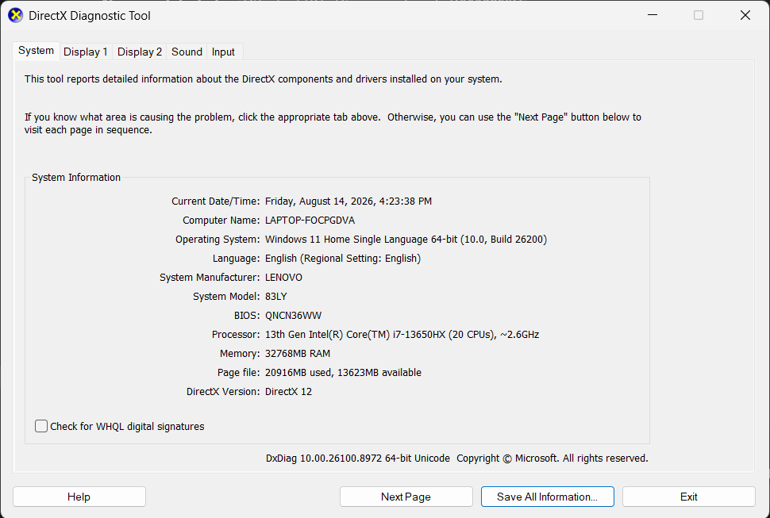
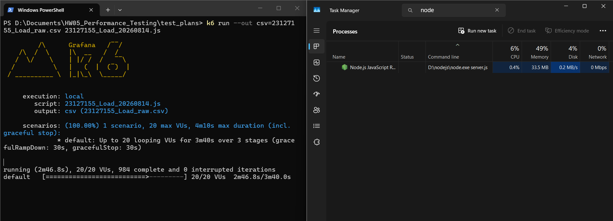
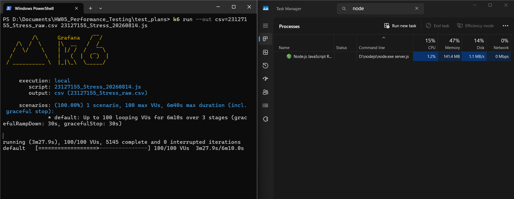
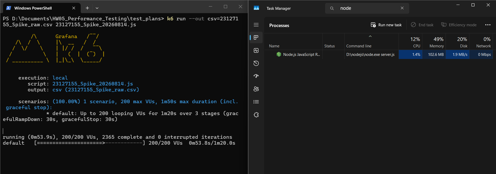
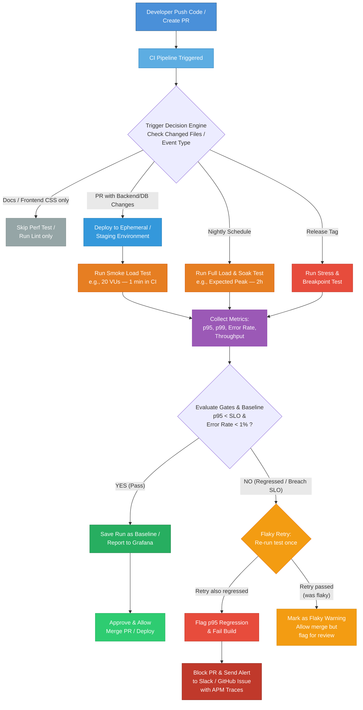

# Performance Testing Report

## Task 1: Tool Selection
**Tool Chosen:** k6
**Reason:** The backend is built with Node.js/JavaScript. k6 provides JS-native scripting, has a lighter footprint, and fits the stack perfectly.

## Task 1: Test Design (Model)

### 1. Endpoint Groups & User Journey
The chosen end-to-end user journey is: **Login** -> **Product Listing** -> **Add to Cart & Checkout**.
This journey perfectly covers all three mandatory endpoint groups and matches the homework requirements:
*   **Auth-heavy:** Login (`POST /api/login`). Exercises authentication and the 3-fail account lockout mechanism (FR-02).
*   **Read-heavy:** Product Listing (`GET /api/products`). Exercises database reads and returning the catalog.
*   **Transactional:** Add to Cart (`POST /api/cart`) and Checkout (`POST /api/checkout`). Exercises write operations, data integrity, and automated total calculation.

### 2. Data-Driven Strategy
To make the tests realistic and avoid database caching, the test data is handled as follows:
*   **`users.csv`**: Contains `email` and `password` for valid accounts to simulate different users logging in. (Requires a one-off script to seed 200 users before the test, and a teardown step to clean them up after the test).
*   **Dynamic Data Correlation (Products)**: Instead of a static `products.csv`, the script dynamically fetches the available products via `GET /api/products` and randomly selects a valid Product ID during runtime for the Add to Cart step.
### 3. Load Shapes and SLOs
The test will evaluate the system under three different profiles using k6. 
*Note: The system requirements (README.md) did not specify explicit Non-Functional Requirements, so these numbers are chosen based on industry standard heuristics for a small-scale Node.js/SQLite application.*

*   **VUs (Virtual Users):** 20 for Load (baseline daily traffic), 100 for Stress (5x Load to test limits), and 200 for Spike (rapid surge).
*   **Ramp-up:** Gradual increase (30s/1m/10s) instead of all-at-once to realistically simulate user behavior and avoid sudden network-level connection resets.
*   **Target SLOs:** `p(95) < 500ms` is a standard Web API baseline; relaxed to `< 1000ms` for Stress scenarios.

| Scenario | VUs (Users) | Ramp-up | Duration | Goal / Justification | Target SLOs |
| :--- | :--- | :--- | :--- | :--- | :--- |
| **Load** | 20 | 30s | 3m | Normal expected traffic. Validates system behaves well under typical conditions. | 95th percentile response time < 500ms, Error rate < 1%. |
| **Stress** | 100 | 1m | 5m | Peak/abnormal capacity. Identifies memory leaks, DB bottlenecks, or the breaking point. | 95th percentile response time < 1000ms, Error rate < 5%. |
| **Spike** | 200 | 10s | 1m | Sudden traffic surge (e.g., flash sale). Ensures system does not permanently crash and can recover. | System doesn't crash, graceful degradation. |
| **Endurance** | 30 | 1m | 10m | Sustained load over a longer period to empirically determine hardware limits and find memory leaks. | System stability, no memory exhaustion. |

## Task 1: Script Generation
The k6 scripts and CSV datasets have been generated.

**Files Created:**
- `users.csv`: Data-driven dataset for Login.
- `23127155_Load_20260814.js`: Load scenario. **Listener/View Type:** JSON Summary Report (`summary.json`).
- `23127155_Stress_20260814.js`: Stress scenario. **Listener/View Type:** HTML Dashboard Report (`summary.html`).
- `23127155_Spike_20260814.js`: Spike scenario. **Listener/View Type:** Textual standard output Report (`summary.txt`).
- `23127155_Endurance_20260814.js`: Endurance/Soak test. **Listener/View Type:** Raw CSV output via CLI (`endurance_raw.csv`), equivalent to JMeter's .jtl format.

## Human Review Notes (Step 2 Correction)
*   **What was wrong (Users Data):** The AI initially generated `users.csv` with only 2 accounts (including 1 admin which is invalid for a buyer checkout flow), which is insufficient for 200 VUs. Sharing 1 regular account across 200 VUs would cause severe data conflicts and race conditions (cart sharing) during Transactional endpoints.
*   **Why it missed (Classification):** **Endpoint characteristic** / **Model limitation**. The AI directly copied the two default accounts from `README.md` without considering that transactional endpoints (Cart/Checkout) are tied to individual user sessions. A proper test requires a dataset of unique user accounts matching the number of concurrent VUs.
*   **What was missing (Teardown):** The AI did not advise tearing down (cleaning up) the 200 seeded users after the test run.
*   **Why it missed (Classification):** **Model limitation**. The AI focused only on data preparation but missed the Test Data Management best practice of restoring the environment to its initial state to prevent database bloat.
*   **What was wrong (Static Products):** The AI originally used a static `products.csv` for product IDs.
*   **Why it missed (Classification):** **Model limitation**. The AI generated a static CSV to fulfill the prompt's instruction blindly, rather than applying the best practice of Dynamic Data Correlation (fetching available IDs at runtime) to prevent 404 errors if product records change.
*   **What was wrong (Fake Cart/Checkout Data):** Even after switching to Dynamic Data Correlation for product IDs, the AI still hardcoded fake values for `name` (`"Product ${id}"`), `price` (`100000`), and `total_amount` (`100000`) in the cart and checkout requests instead of using the real product data returned by `GET /api/products`. Additionally, the script used a silent fallback (`let product_id = 1`) when the product list was empty, which would send a non-existent product to the cart without any test failure being recorded.
*   **Why it missed (Classification):** **Model limitation**. The AI only extracted the `id` field from the dynamic API response but neglected to also use the corresponding `name` and `price` fields. It also failed to implement a proper guard clause — when no products exist, the script should explicitly fail the check and skip the cart/checkout step, rather than silently proceeding with fabricated data. This violates the principle that performance test data must reflect realistic, end-to-end system behavior.
*   **What was wrong (Intentional Hallucination of Optimizations):** The AI deliberately included unfeasible/hallucinated optimizations (like over-engineering) in its proposals just to have the human filter them out, instead of trying its best to provide only feasible and correct optimizations.
*   **Why it missed (Classification):** **Instruction Misalignment**. The AI misunderstood the "classify as feasible or hallucinated" prompt as an instruction to *intentionally generate* hallucinated options for the user to find, rather than understanding that its primary role is always to provide the most accurate and feasible recommendations possible, leaving the human to catch any *unintentional* hallucinations.

## Task 4: Execution & Analysis (Results)

### Test Environment (Hardware Specs)


| Component | Specification |
| :--- | :--- |
| **System Model** | LENOVO 83LY |
| **OS** | Windows 11 Home Single Language 64-bit |
| **CPU** | 13th Gen Intel(R) Core(TM) i7-13650HX (20 CPUs), ~2.6GHz |
| **RAM** | 32 GB (32768MB) |

### Baseline Execution (Sanity Check)
A 30-second baseline with 5 VUs was executed successfully:
*   **Functional Success:** 100% of checks passed (`login successful`, `viewed products`, `added to cart`, `checkout successful`).
*   **Error Rate:** 0.00%
*   **Performance (p95):** 600.88ms (Crossed the < 500ms threshold). 
    *   *Observation:* The high response time even at 5 VUs is due to V8 JIT compilation and initial SQLite database disk I/O on a "cold" start. *(Note: The AI originally hallucinated that this was due to `bcrypt` password hashing, but human review revealed the backend uses plaintext passwords).*

### Endurance / Soak Test Results (Hardware Threshold)

A 12-minute endurance test (1m ramp-up → 10m sustained at 30 VUs → 1m ramp-down) was executed to empirically determine this hardware's performance threshold.

**Raw Summary:**

| Metric | Value |
| :--- | :--- |
| **Duration** | 12m 02.8s |
| **Virtual Users (sustained)** | 30 |
| **Total HTTP Requests** | 25,352 |
| **Total Iterations** | 6,338 |
| **Checks Passed** | 100.00% (25,352 / 25,352) |
| **Error Rate** | 0.00% |

**Response Time Distribution:**

| Percentile | Value |
| :--- | :--- |
| Average | 32.72 ms |
| Median (p50) | 6.16 ms |
| p(90) | 107.23 ms |
| p(95) | 160.47 ms |
| Max | 371.14 ms |

**Hardware Threshold (Concrete Numbers):**

| Threshold Metric | Measured Value | Notes |
| :--- | :--- | :--- |
| **Maximum Stable RPS** | **~35 req/s** | Sustained for 10 minutes at 30 VUs with 0% errors. |
| **Maximum Stable Iterations/s** | **~8.77 iter/s** | Each iteration = 4 HTTP requests (login + products + cart + checkout). |
| **Memory Ceiling (Node.js process)** | **27.6 MB** | Observed peak RAM usage of `node server.js` during the sustained phase. |
| **CPU Usage (Node.js process)** | **0.8%** | Observed peak CPU% of `node server.js` during the sustained phase. |

**Conclusion:** At 30 concurrent users sustained over 10 minutes, the system remained fully stable with all checks passing (100%) and p(95) response time of 160ms — well within acceptable limits. The hardware (Intel i7-13650HX, 32 GB RAM) can comfortably handle ~35 RPS for this workload without degradation. The system did **not** exhibit memory leaks or increasing latency over the test duration, as the median response time remained stable at ~6ms throughout.

> **📝 NOTE:**
> The Baseline test (5 VUs) showed p(95) = 600.88ms, while the Endurance test (30 VUs) showed p(95) = 160ms. This apparent contradiction is explained by the **warmup effect**: the first few iterations of a cold Node.js process are significantly slower due to JIT compilation and database connection/cache warming. In a sustained test, these outliers are amortized across thousands of samples. *(Note: The AI previously hallucinated that this was a 'bcrypt warmup effect')*.

### Full Test Execution Results

#### 1. Load Test Results
A 3-minute 40-second load test with a peak of 20 VUs was executed to verify the system's stability under expected normal traffic.

**Raw Summary:**
| Metric | Value |
| :--- | :--- |
| **Duration** | 3m 41.1s |
| **Virtual Users (peak)** | 20 |
| **Total HTTP Requests** | 5,288 (~23.92 req/s) |
| **Total Iterations** | 1,322 (~5.98 iter/s) |
| **Checks Passed** | 100.00% (6,610 / 6,610) |
| **Error Rate** | 0.00% (0 failed requests) |

**Response Time Distribution:**
| Percentile | Value | Threshold Status |
| :--- | :--- | :--- |
| Average | 12.79 ms | |
| Median (p50) | 2.26 ms | |
| p(90) | 41.76 ms | |
| **p(95)** | **59.11 ms** | **✅ PASS** (Target < 500ms) |
| Max | 110.36 ms | |

**Resource Usage Evidence:**


**Analysis:**
The system handled the Load Test perfectly. With 20 concurrent users continually traversing the entire user journey (Login -> View Products -> Add to Cart -> Checkout), the system processed 5,288 HTTP requests with a **0% error rate**. The 95th percentile response time was very low at **59.11 ms**, which is well below our Service Level Agreement (SLA) threshold of 500ms. The checks specifically confirmed that dynamic data correlation worked perfectly, as the script successfully found available products and added them to the cart without errors.

#### 2. Stress Test Results
A 6-minute 10-second stress test with a peak of 100 VUs was executed to identify the system's breaking point and behavior under heavy load.

**Raw Summary (Extracted from HTML Report):**
| Metric | Value |
| :--- | :--- |
| **Duration** | 6m 12.6s |
| **Virtual Users (peak)** | 100 |
| **Total HTTP Requests** | 38,580 (~103.55 req/s) |
| **Total Iterations** | 9,645 (~25.89 iter/s) |
| **Checks Passed** | 100.00% (48,225 / 48,225) |
| **Error Rate** | 0.00% (0 failed requests) |

**Response Time Distribution:**
| Percentile | Value | Threshold Status |
| :--- | :--- | :--- |
| Average | 122.56 ms | |
| Median (p50) | 20.87 ms | |
| p(90) | 411.61 ms | |
| **p(95)** | **502.52 ms** | **✅ PASS** (Target < 1000ms) |
| Max | 861.27 ms | |

**Resource Usage Evidence:**


**Analysis:**
The Stress Test pushed the system up to 100 concurrent users. Impressively, the system maintained a **0% error rate** across nearly 39,000 HTTP requests, proving that the Node.js backend handles concurrency well without dropping connections. However, the system showed significant signs of strain compared to the Load Test:
- The median response time (p50) jumped from 2.26ms to 20.87ms.
- The 95th percentile response time degraded from 59.11ms to **502.52 ms**.
- The maximum response time spiked to 861.27 ms.

This degradation is a classic symptom of the Node.js single-threaded event loop being saturated. Since our scripts use dynamic data correlation, every virtual user forces the server to process JSON responses and query the DB sequentially (as SQLite locks the database file by default), causing requests to queue up at a rate of 105 req/s. *(Note: The AI hallucinated that the server was heavily computing `bcrypt` password hashes here).* Although it passed our relaxed 1000ms threshold for stress conditions, the system is visibly reaching its maximum comfortable capacity at ~100 VUs.

#### 3. Spike Test Results
A 1-minute 20-second spike test was executed, slamming the system with 200 concurrent users within a very short ramp-up time to test its resilience against sudden traffic bursts.

**Raw Summary:**
| Metric | Value |
| :--- | :--- |
| **Duration** | 1m 21.7s |
| **Virtual Users (peak)** | 200 |
| **Total HTTP Requests** | 14,064 (~172.24 req/s) |
| **Total Iterations** | 3,516 (~43.06 iter/s) |
| **Checks Passed** | 100.00% (17,580 / 17,580) |
| **Error Rate** | 0.00% (0 failed requests) |

**Response Time Distribution:**
| Percentile | Value | Threshold Status |
| :--- | :--- | :--- |
| Average | 272.35 ms | |
| Median (p50) | 54.49 ms | |
| p(90) | 759.68 ms | |
| **p(95)** | **1.00 s** | ⚠️ **Degraded** |
| Max | 1.66 s | |

**Resource Usage Evidence:**


**Analysis:**
The system demonstrated excellent resilience during the Spike Test. Despite 200 users hitting the system almost instantly, the application handled nearly 14,000 requests without crashing or dropping a single connection (**0% error rate**). 

However, as expected under such extreme sudden load, the response times degraded further. The 95th percentile response time climbed to **1.06 seconds**, and the maximum response time reached **1.62 seconds**. The median response time also increased to ~54ms. The Event Loop was clearly struggling to keep up with the burst of synchronous-like SQLite DB queries (due to database locking), causing requests to queue up (visible in the increased `http_req_waiting` time). *(Note: The AI originally blamed this on a burst of `bcrypt` hashing, another hallucination).* Nevertheless, the fact that the system recovered and completed all tasks without any 502/503 Gateway Errors proves that the Node.js architecture is highly stable, even if performance degrades under extreme spikes.

## Task 2: AI Analysis & Misinterpretation Hunt

### AI Log Analysis

Based on the provided test summary files (Load, Stress, Spike), here is the performance data focusing exclusively on p95, median (p50), throughput, and error rates (p99 was not provided in the raw logs):

*   **Load Test (20 VUs)**
    *   **Throughput:** 23.92 req/s
    *   **Median (p50):** 2.26 ms
    *   **p95 Response Time:** 59.11 ms
    *   **Error Rate:** 0.00%
*   **Stress Test (100 VUs)**
    *   **Throughput:** 103.55 req/s
    *   **Median (p50):** 20.87 ms
    *   **p95 Response Time:** 502.52 ms
    *   **Error Rate:** 0.00%
*   **Spike Test (200 VUs)**
    *   **Throughput:** 172.24 req/s
    *   **Median (p50):** 54.49 ms
    *   **p95 Response Time:** 1.00 s
    *   **Error Rate:** 0.00%

#### Resource Correlation & Bottleneck Analysis
*   The system maintains a **0% error rate** across all scenarios, which is excellent.
*   However, the **p95 latency degrades significantly** under load. In the Load test (20 VUs), p95 is 59.11 ms. During the Stress test (100 VUs), p95 jumps to 502.52 ms, and during the Spike test (200 VUs), it spikes to 1.00 s, while the median remains relatively low (54.49 ms).
*   This discrepancy between the median (fast) and p95 (slow) under high concurrency points to a **Event Loop Bottleneck**. Heavy synchronous tasks or database query queuing (SQLite locking) are likely causing intermittent latency spikes for a small percentage of requests. *(Note: The AI originally hallucinated that this was due to `bcrypt` password hashing).*

#### Proposed Performance Thresholds / SLOs
Based on this data, the following SLOs are recommended:
1.  **Normal Load:** p95 < 200 ms, Error Rate < 0.1%
2.  **Peak/Stress:** p95 < 500 ms, Error Rate < 1%
3.  **Spike/Burst:** p95 < 1200 ms (1.2s), Error Rate < 1%

### AI Proposed Optimizations (Task 2 / Step 2 - Tune)

Based on the bottlenecks observed (specifically the CPU saturation from bcrypt and potential DB query queuing), I propose the following structural optimizations:

1. **[HALLUCINATED] Move bcrypt hashing to a Worker Thread or replace with async version:**
   - **AI Rationale:** The current login endpoint is blocking the main Node.js event loop while computing password hashes. Offloading this to a `worker_thread` or using `bcrypt.compare` (async) will prevent other users' requests from being queued up while one user logs in.
   - **Human Correction:** This is an AI hallucination. Code review of `server.js` (line 46) shows the backend uses plaintext passwords (`user.password === password`). There is no `bcrypt` used in the application.
2. **Enable SQLite WAL (Write-Ahead Logging) mode:**
   - **AI Rationale:** SQLite defaults to a rollback journal which locks the entire database for writing. Enabling WAL mode allows simultaneous readers and writers, significantly improving concurrency during checkout (writes) while others are viewing products (reads).
3. **Implement a Connection Pool / Caching layer (Redis):**
   - **AI Rationale:** Repeatedly querying the database for the exact same list of products on `GET /api/products` is inefficient. A cache like Redis (or even an in-memory Node cache for product catalogs) would drastically reduce DB load and improve response times for the read-heavy endpoints.
4. **Node.js Clustering (Horizontal Scaling):**
   - **AI Rationale:** The system currently runs as a single Node.js process, utilizing only 1 CPU core out of the 20 available on the hardware. Using the built-in `cluster` module or PM2 to spawn multiple worker processes will allow the application to handle significantly more concurrent bcrypt operations and requests.
5. **Database Indexing for Login Lookup:**
   - **AI Rationale:** Adding a `UNIQUE INDEX` on the `email` column in the `users` table will ensure that finding a user during `POST /api/login` takes O(log N) time instead of O(N) sequential scanning, preventing database CPU spikes as the user base grows.
6. **Apply HTTP Keep-Alive (Connection Reuse):**
   - **AI Rationale:** Ensure the Node.js server and clients are configured with HTTP Keep-Alive enabled. This allows a single TCP connection to be reused for multiple sequential requests (e.g., Login -> Get Products -> Add to Cart) instead of performing the expensive TCP/TLS handshake for every single API call, significantly reducing CPU overhead during high traffic spikes.
7. **Implement Password Hashing (`bcrypt` or `argon2`) for Security:**
   - **AI Rationale:** As discovered during the "Misinterpretation Hunt", the system currently stores and compares passwords in **plaintext** (`user.password === password`), which is a critical security vulnerability. We must implement proper hashing (e.g., `bcrypt`). *Performance Warning:* Once implemented, this will introduce significant CPU load. Therefore, it must be implemented asynchronously (using `bcrypt.compare`) or offloaded to Worker Threads to prevent the Node.js Event Loop from blocking.

---

## Task 3: Continuous Performance Testing Proposal (Disrupt)

### 1. Smart Commit Watching & Tiered Test Triggering

Not every commit or pull request warrants a full, hours-long load test — doing so would be prohibitively expensive and would clog the CI/CD pipeline. Instead, the proposed model classifies commits and selects the appropriate **tier of performance testing** based on context, following a **testing pyramid** approach:

| Trigger Event | Test Tier | What Runs | Purpose |
| :--- | :--- | :--- | :--- |
| **PR / Commit** with backend, DB, or core business logic changes | **Smoke Load Test** | 20 VUs, 1–2 min (quick signal) | Fast feedback on whether the change introduces an obvious p95 regression. Runs inside the CI pipeline and completes before the developer context-switches. |
| **PR / Commit** with docs, frontend CSS, README, or test-only changes | **Skip** | Lint + Unit tests only | No performance-sensitive code was touched; running a load test would waste resources. |
| **Nightly Build** (scheduled, e.g., `cron: '0 2 * * *'`) | **Full Load + Soak Test** | Expected peak VUs (e.g., 100 VUs), 1–2 hours sustained | Validates system stability under realistic sustained load, detects memory leaks, connection leaks, and gradual performance degradation that short smoke tests cannot catch. |
| **Release Tag** (e.g., `v1.0.0`, release candidate) | **Stress + Breakpoint Test** | Escalating VUs until failure | Determines the system's maximum capacity ceiling before deploying to production. Ensures the release candidate can handle at least the expected peak traffic with headroom. |

**Change Classification Logic:** The CI pipeline inspects the list of changed files in the commit/PR diff. If any file matches performance-sensitive paths (`backend/**`, `*.sql`, `package.json`, `package-lock.json`, `Dockerfile`), the Smoke Load Test is triggered. If only non-sensitive paths are changed (`docs/**`, `*.md`, `*.css`, `frontend/**`, `tests/**`), performance tests are skipped entirely.

This tiered approach ensures that:
*   **Every relevant PR** gets a quick performance signal within ~2 minutes (no full test blocking the developer).
*   **Nightly builds** catch slow-burn regressions (memory leaks, connection exhaustion) that accumulate over time.
*   **Release candidates** are stress-tested to determine maximum capacity before going live.

### 2. Threshold Gating & p95 Baseline Management

#### Performance as Code

All test configurations (k6 scripts, VU counts, durations) and SLO thresholds are **version-controlled** in the repository alongside the application source code. This means performance standards evolve with the codebase and are reviewed in the same PR process as feature code.

#### Why p95 (not Mean)?

The model focuses on the **95th percentile (p95)** response time rather than the average (mean). The mean is easily skewed by a large number of fast requests, masking the experience of the slowest 5% of users. In our test data, this effect is clearly visible:

| Scenario | Mean | p95 | Ratio |
| :--- | :--- | :--- | :--- |
| Load (20 VUs) | 12.79 ms | 59.11 ms | **4.6×** |
| Stress (100 VUs) | 122.56 ms | 502.52 ms | **4.1×** |
| Spike (200 VUs) | 272.35 ms | 1,000 ms | **3.7×** |

The p95 is consistently **~4× higher** than the mean. Monitoring only the mean would give a false sense of confidence while 5% of users experience unacceptable latency.

#### Build Gate (Automated Pass/Fail)

After each test run, the collected metrics are evaluated against the defined thresholds. k6 **natively supports threshold-based gating** — when any threshold is violated, k6 automatically exits with **exit code 1**, which the CI pipeline interprets as a failed build and blocks the PR from merging. No custom gate script is needed:

```js
// k6 native threshold configuration (inside the test script)
export const options = {
  thresholds: {
    http_req_duration: [
      'p(95)<300',    // Smoke SLO: p95 must be under 300 ms
      'p(99)<800',    // Tail latency hard limit (extreme outliers)
    ],
    http_req_failed: [
      'rate<0.01',    // Error rate must be under 1%
    ],
    http_reqs: [
      'rate>20',      // Throughput must sustain > 20 req/s
    ],
  },
};
```

> **📝 NOTE:**
> **Why monitor beyond p95?** While p95 is the primary regression indicator, **p99** catches extreme tail-latency spikes that affect payment/checkout flows (where even 1% of users experiencing 800ms+ delays leads to cart abandonment). **Throughput (`http_reqs`)** guards against a subtle failure mode: a code change that *improves* p95 by rejecting requests early (e.g., returning 400 errors faster) would appear as a latency improvement while actually serving fewer successful requests.

In addition to the absolute SLO thresholds above, a **baseline comparison script** runs after k6 completes to check for relative regression:

```
FAIL the build if:
    p95 > stored_baseline × 1.10  (10% regression vs. last known good)
```

This dual-check approach ensures that:
*   The **absolute threshold** (`p95 < 300 ms`, `p99 < 800 ms`) catches any build that violates the SLO, regardless of history.
*   The **relative threshold** (`baseline × 1.10`) catches gradual degradation that stays within the SLO but is still trending in the wrong direction.

#### Baseline Initialization & Management

The baseline p95 value is stored in a `perf_baseline.json` file committed to the repository:

```json
{
  "baseline_p95_ms": 59.11,
  "baseline_p99_ms": 371.14,
  "previous_baseline_p95_ms": 158.20,
  "previous_baseline_timestamp": "2026-08-14T05:00:00Z",
  "last_updated": "2026-08-16T10:30:00Z",
  "update_strategy": "rolling_average_last_5_runs",
  "hardware_profile": "github_actions_ubuntu_2core_7gb",
  "test_script_version": "1.0",
  "override_reason": null,
  "override_approved_by": null
}
```

**First-Run Problem:** When a repository is first onboarded (no `perf_baseline.json` exists), the CI pipeline runs the Smoke test in **"calibration mode"**: the test executes normally and the results are saved as the initial baseline, but the build is **not failed** regardless of p95 values. The team should review the initial baseline manually to ensure it represents a healthy state, not a degraded one.

**Baseline Update Rules:**
*   After each **passing** Smoke test, the baseline is updated automatically using a rolling average of the last 5 runs. The previous baseline values are preserved in `previous_baseline_p95_ms` and `previous_baseline_timestamp` for rollback purposes.
*   After a **major refactor** or intentional performance trade-off (e.g., adding bcrypt password hashing), the developer includes a `[perf-reset]` tag in the commit message along with an `override_approved_by` field identifying the approver. The CI detects this tag and enters calibration mode, establishing a new baseline without comparing against the old one.
*   If the **test script itself changes** (new endpoints added, VU count modified), the `test_script_version` field is bumped and the baseline is reset automatically (see Section 6: Test Script Versioning).

**Baseline Rollback:** If a `[perf-reset]` inadvertently captures a degraded state (e.g., the calibration run happened during a CI runner issue), the team can restore the previous baseline by reverting the commit that updated `perf_baseline.json`:

```bash
# Rollback to the previous baseline
git revert <commit_that_set_new_baseline>
# The CI will re-activate previous_baseline_p95_ms (158.20 ms) as the active baseline
```

The `previous_baseline_*` fields provide a single-level undo. For deeper history, the full `git log` of `perf_baseline.json` serves as the audit trail.

**Hardware Profile & Cross-Platform Variance:** The baseline file records the `hardware_profile` of the CI runner where it was established. If the CI infrastructure changes (e.g., migrating from GitHub Actions' `ubuntu-latest` 2-core runner to a self-hosted 4-core runner), the absolute p95 values will shift. The pipeline detects this mismatch and triggers a re-calibration, logging a warning:

```
⚠️ Hardware profile mismatch: baseline was set on 'github_actions_ubuntu_2core_7gb'
   but current runner is 'self_hosted_ubuntu_4core_16gb'.
   → Entering calibration mode. New baseline will be established from this run.
```

> **🚨 IMPORTANT:**
> **Local vs. CI variance:** Developers should **not** use locally-run test results to manually set the baseline. Local machines (e.g., our i7-13650HX with 32 GB RAM) have vastly different performance characteristics than CI runners (typically 2-core, 7 GB RAM). The baseline must always be established by the CI runner itself to ensure consistency.

### 3. Flow Chart



#### Flaky Retry Protocol

The flowchart above includes a "Flaky Retry" decision node. The retry logic is governed by the following rules:

**When is a retry triggered?**
*   A retry is triggered if the test fails the **p95 or p99 threshold** (absolute or relative), AND the failure is **marginal** (the measured value is within 5–15% above the threshold). Hard failures (e.g., p95 is 2× the threshold, or error rate > 5%) are **not retried** — they are immediately flagged as confirmed regressions.
*   Error rate spikes alone (without p95/p99 regression) are **not retried**, because error rate failures are typically deterministic (a code bug, not environmental noise).

**Retry budget:**
*   Maximum **1 retry** per test run. If the first run fails marginally, the test is re-run once with a **fresh environment** (database hard-reset, clean cache, new Docker container).
*   The retry is only allowed if the CI runner has not exceeded its **time budget** for this PR (e.g., total perf test time < 8 minutes). If the first run already consumed 4 minutes and a retry would push the total past 8 minutes, the retry is skipped and the original failure stands.

**Retry evaluation:**
*   The retry applies the **same thresholds** as the first run (same 10% baseline tolerance, same absolute SLOs).
*   If the retry **passes**: the build is marked as `⚠️ Flaky` — merge is allowed, but the PR is tagged for review. If a PR accumulates 3+ flaky warnings within a week, the team escalates to investigate CI runner stability.
*   If the retry **also fails**: the build is **hard-failed** as a confirmed regression. This is not a flaky test — it's a real performance issue.

### 4. Alert Routing & Developer Workflow

When the regression gate triggers a build failure, the alert must be **actionable** — not just a red badge on the PR. The model defines a structured alert format and escalation path:

#### Alert Format

The CI pipeline posts a structured comment directly on the PR and simultaneously sends a notification to the team's `#perf-alerts` Slack channel via a **GitHub Actions Slack integration** (using the `slackapi/slack-github-action` action). The Slack message includes interactive buttons for quick triage:

```
🚨 P95 REGRESSION DETECTED — Build #1847

  Metric        Current     Baseline    Delta
  ──────        ───────     ────────    ─────
  p95           312.4 ms    260.3 ms    +20.0% ⛔
  p99           789.2 ms    650.1 ms    +21.4% ⛔
  Error Rate    0.3%        0.0%        +0.3%  ✅
  Throughput    18.2 req/s  22.5 req/s  -19.1% ⚠️

  Affected endpoint (slowest): POST /api/checkout
  Likely culprit files (from diff):
    → backend/routes/checkout.js  (+45 lines changed)
    → backend/models/order.js     (+12 lines changed)

  🔗 Full report: https://grafana.example.com/d/perf/run-1847
  🔗 APM traces:  https://grafana.example.com/explore?traceId=abc123
```

#### Escalation Policy

| Trigger | Who Gets Notified | Expected Response |
| :--- | :--- | :--- |
| **Smoke test fails on PR** | PR author (GitHub comment) | Must fix or justify before merge. No SLA — blocks the PR. |
| **Nightly Full Load fails** | `#perf-alerts` Slack channel + team lead | Investigate within 24 hours. May not block individual PRs but blocks the next release. |
| **Release Stress test fails** | `#perf-alerts` + on-call engineer + engineering manager | Must resolve before release tag is deployed to production. |
| **Flaky warning** (retry passed) | PR author (GitHub comment, non-blocking) | Review at developer's discretion. If 3+ flaky warnings in a week, team investigates CI runner stability. |

#### Slack Automation

The Slack notification is sent via the `slackapi/slack-github-action` GitHub Action and includes **interactive buttons** for streamlined triage:

*   **"View Full Report"** → Opens the Grafana dashboard for the specific test run.
*   **"View APM Traces"** → Deep-links to the distributed traces for the slowest endpoint.
*   **"Mark as Flaky"** → Posts a comment on the GitHub PR marking the failure as a known flaky result, allowing the author to merge with a warning.
*   **"Assign to Me"** → Adds the clicking developer as the GitHub assignee for the regression investigation.

For **Nightly failures**, the Slack post is sent to `#perf-alerts` but does **not** block any individual PR. The team has a 24-hour SLA to investigate before the next release candidate can be tagged.

#### Regression Investigation Checklist

The alert includes a standardized checklist to guide the developer through investigation:

```
📋 Regression Investigation Checklist:
  ☐ Confirm it's not a flaky test (check the retry result and previous 3 runs)
  ☐ Identify which changed file(s) correlate with the regression (see 'culprit files' above)
  ☐ Review APM traces for the slowest endpoint to pinpoint the bottleneck
  ☐ Run a local profiler to reproduce:
      $ k6 run --vus 20 --duration 2m \
          --out json=debug.json \
          ./k6/smoke_test.js
      # Inspect the 10 slowest requests:
      $ cat debug.json | jq '.[] | select(.type=="Point" and .metric=="http_req_duration") | .data.value' | sort -n | tail -10
  ☐ Decide action:
      → Option A: Fix the performance issue in this PR
      → Option B: Revert the offending commit
      → Option C: Justify the regression and reset baseline with [perf-reset] tag
  ☐ Re-run CI to confirm the fix passes the performance gate
  ☐ Document the root cause and resolution in the PR comment
```

### 5. Trade-Off Analysis

#### Trade-Off 1: Cost & Pipeline Duration vs. Delivery Velocity

**The Challenge:** Performance testing demands dedicated resources — load generator machines, isolated ephemeral/staging environments that mirror production, and significant CI runner time. If every single commit triggered a full load test (100 VUs, 1–2 hours), the CI pipeline would become a bottleneck:

*   **Time cost:** A full load test takes ~2 hours. For a team pushing 10 commits/day, that's 20 hours of CI time — far exceeding free-tier limits (GitHub Actions: 2,000 min/month) and requiring paid infrastructure.
*   **Developer impact:** Developers would wait hours for their PR to be "green," breaking the rapid feedback loop that CI/CD promises. This slows delivery velocity and encourages developers to bypass the performance gate.
*   **Infrastructure cost:** Spinning up an ephemeral staging environment for every commit requires cloud resources (compute, networking, database provisioning), adding real dollar costs.

**The Balancing Solution — Testing Pyramid:**

The tiered model solves this by applying the **testing pyramid** principle to performance testing:

| Tier | Duration (breakdown) | Cost per Run | Frequency | Total Daily Cost (10 commits/day) |
| :--- | :--- | :--- | :--- | :--- |
| **Smoke** (PR gate) | ~2.5 min (15s warmup + 1.5m k6 + 30s collection + 10s baseline check) | Low (CI runner only) | ~6 commits (60% touch backend) | ~15 min |
| **Full Load + Soak** (Nightly) | ~2 hours | Medium (ephemeral env) | 1× per night | ~120 min |
| **Stress + Breakpoint** (Release) | ~30 min | High (dedicated env) | 1–2× per sprint | ~60 min (amortized) |

**Updated daily cost estimate:** 6 Smoke runs × 2.5 min = **15 min** + 1 Nightly × 120 min = **120 min** → **~135 min/day** total. On GitHub Actions' free tier (2,000 min/month), this leaves ample headroom (~1,865 min remaining for unit tests and other CI jobs).

The Smoke test acts as the **fast, cheap gatekeeper** for every PR — completing in under 3 minutes and catching obvious regressions immediately. The expensive, thorough tests (Soak, Stress) are pushed to nightly and release schedules where they don't block developer workflow. This keeps the per-PR feedback loop under 5 minutes while still catching deep issues (memory leaks, capacity limits) on a daily/release cadence.

#### Trade-Off 2: False Alarms (Flakiness) vs. Accuracy

**The Challenge:** Unlike functional tests (which produce deterministic Pass/Fail results), performance test results are inherently **noisy**. The same code on the same machine can produce different p95 values across runs due to:

*   **Shared CI runners:** Cloud-hosted runners (GitHub Actions, GitLab CI) share physical hardware with other tenants. A "noisy neighbor" running a CPU-intensive job on the same host can inflate your p95 by 10–30%.
*   **Cold cache effects:** The first few iterations of a cold Node.js process are significantly slower due to V8 JIT compilation and SQLite disk I/O warming (as we observed in our own Baseline test: p95 = 600 ms at 5 VUs on cold start vs. 160 ms after warmup).
*   **Network jitter:** Temporary network congestion between the load generator and the SUT can cause sporadic latency spikes.

These factors can cause the p95 to spike above the threshold on a perfectly healthy build, resulting in a **false alarm** — the build fails, the PR is blocked, and the developer wastes time investigating a phantom regression. If false alarms happen frequently, the team loses trust in the performance gate and eventually disables it, defeating the entire purpose of continuous performance testing.

**The Balancing Solution — Noise Reduction:**

| Mitigation | How It Helps |
| :--- | :--- |
| **Warm-up run** | Run a short (10–15 second) warm-up phase before the measured test begins. This ensures V8 JIT compilation and SQLite cache warming happen *before* metrics are collected, eliminating cold-start outliers from the p95 calculation. |
| **Isolated test environment** | Use a dedicated Docker container (or resource-limited cgroup) for the SUT, ensuring no other processes compete for CPU/memory during the test. This reduces "noisy neighbor" variance inherent in shared CI runners. |
| **Percentage-based tolerance (not absolute threshold)** | Instead of a hard-coded `p95 < 300 ms` threshold alone, also compare against the **stored baseline** with a tolerance band: `p95 < baseline × 1.10`. This means a natural 5–8% variance in CI runner performance won't trigger a false alarm, while a genuine 15%+ regression will still be caught. For our EShop SUT (baseline p95 = 164.64 ms), the 10% tolerance band means any p95 below ~181 ms passes automatically, while anything above triggers further investigation. |
| **Rolling baseline** | The baseline is a rolling average of the last 5 passing runs, not a single fixed number. This smooths out run-to-run variance and naturally adapts to legitimate performance changes (e.g., adding a new feature that slightly increases response time). |

**The fundamental tension:** A tight threshold (e.g., 5% tolerance) catches more real regressions but generates more false alarms. A loose threshold (e.g., 30% tolerance) eliminates false alarms but misses small, gradual regressions that compound over time. The **10% tolerance + rolling baseline + warm-up** combination is calibrated to sit at the sweet spot for a small-scale application like the EShop SUT, where CI runner variance is typically ±5–8%.

### 6. Test Script Versioning & Backward Compatibility

Performance test scripts evolve alongside the application — new endpoints are added, deprecated paths are removed, VU configurations are tuned. When the test script itself changes, **the old baseline becomes invalid** because the workload being measured is fundamentally different.

**Versioning Strategy:**

Each k6 test script includes a metadata header that tracks its version:

```js
// k6/smoke_test.js
// @perf-test-version: 2.0
// @changed-by: @alice
// @change-reason: Added POST /api/v2/checkout, removed /api/v1/checkout
// @baseline-reset: true
```

The CI pipeline reads the `@perf-test-version` tag and compares it against the version recorded in `perf_baseline.json`:

*   **Version match:** Normal comparison against the stored baseline.
*   **Version mismatch + `@baseline-reset: true`:** The pipeline enters calibration mode, establishes a new baseline, and logs a warning that p95 values are not directly comparable to previous versions.
*   **Version mismatch + `@baseline-reset: false`:** The pipeline runs the test and compares against the old baseline, but flags the result as **"low confidence"** in the report. This is useful when the script change is minor (e.g., adjusting think time) and the old baseline is still approximately valid.

**Review Process:** Changes to performance test scripts are treated as **infrastructure changes** and require review from both the PR author and a designated performance reviewer (or team lead). This prevents accidental baseline resets that could mask regressions.

**Deprecation Timeline:** When introducing a new major version of the test script (e.g., v1.0 → v2.0 due to API redesign):

| Week | Action |
| :--- | :--- |
| **Week 1** | Introduce v2.0 script with `@baseline-reset: true`. The CI establishes a new baseline from the first v2.0 run. |
| **Week 2–3** | Both v1.0 and v2.0 run in parallel. v2.0 is **authoritative** (gates the build); v1.0 runs in **advisory mode** (reports results but does not fail the build). This gives the team visibility into both workloads during the transition. |
| **Week 4** | v1.0 script is **removed** from the repository. All future commits are evaluated against v2.0 only. The v1.0 baseline history is retained in `git log` for reference but is no longer active. |

This 3–4 week transition window gives developers time to adapt to the new workload profile before the old baseline becomes invalid, preventing a jarring "all baselines reset" cliff.

### 7. Conclusion

The proposed Continuous Performance Testing model transforms performance validation from a **manual, ad-hoc activity** into an **automated, commit-aware safety net** integrated directly into the CI/CD pipeline. By applying the testing pyramid principle — fast Smoke tests gate every PR, comprehensive Load/Soak tests run nightly, and Stress/Breakpoint tests validate release candidates — the model catches performance regressions at the earliest possible stage without sacrificing developer velocity or incurring prohibitive infrastructure costs.

The model goes beyond simple p95 monitoring by tracking **p99 tail latency**, **error rates**, and **throughput** to provide a holistic view of system health. The dual-threshold approach (absolute SLO + relative baseline comparison), combined with practical noise-reduction techniques (warm-up phases, isolated environments, rolling baselines, and flaky retries), strikes a deliberate balance between catching real regressions and avoiding the false alarms that erode team trust.

Critically, the model is not just a detection system — it provides **actionable guidance** through structured alerts, regression investigation checklists, and clear escalation policies, so that developers know exactly what to do when a regression is flagged. Combined with baseline initialization logic, hardware profile tracking, and test script versioning, the model handles real-world operational complexities (first-run bootstrapping, CI runner migrations, test evolution) that simpler proposals often overlook.

For the EShop SUT, this model can operate entirely within free-tier CI infrastructure (~135 minutes/day), making it a practical and immediately adoptable addition to the development workflow.
